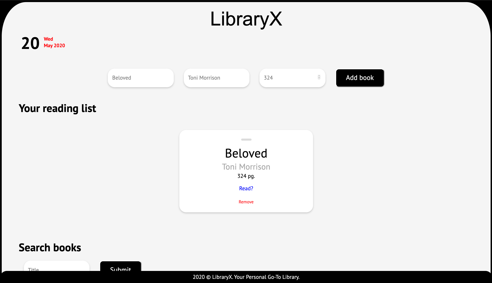
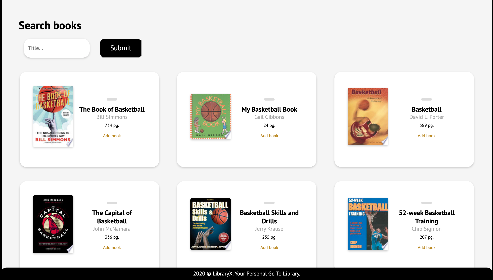
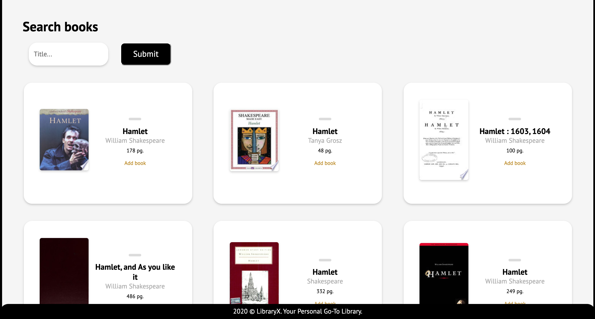
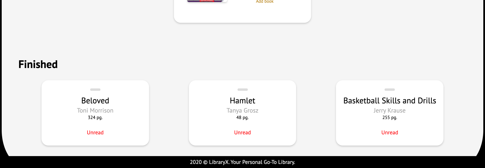

# LibraryX 
This is a web app version of your library. You can add a book you are reading by inputting the title, author, and the page count. You can search for specific books you want, certain subjects, or authors you want to read. You can add the book to your reading list through this search process as well if you would like.

A list of your books will be shown above the 'Search books' heading. It will show the titles, author, and the page counts of the book. If you finished the book, click 'Read?' and it will show up under the 'Finished' heading at the bottom of the page. Accidentally clicked 'Read?', don't worry, just click 'Unread' to put it back in your reading list. And of course, you can remove the book from your reading list if you want by clicking 'Remove'.

# Screenshots

# API
Used an API by Google Books to retrieve books for the user.

# Notes
I used SCSS/SASS in this project so I used the 'sass --watch library.scss:library.css' line in my command line to automatically interpret my SCSS code into CSS code to run.